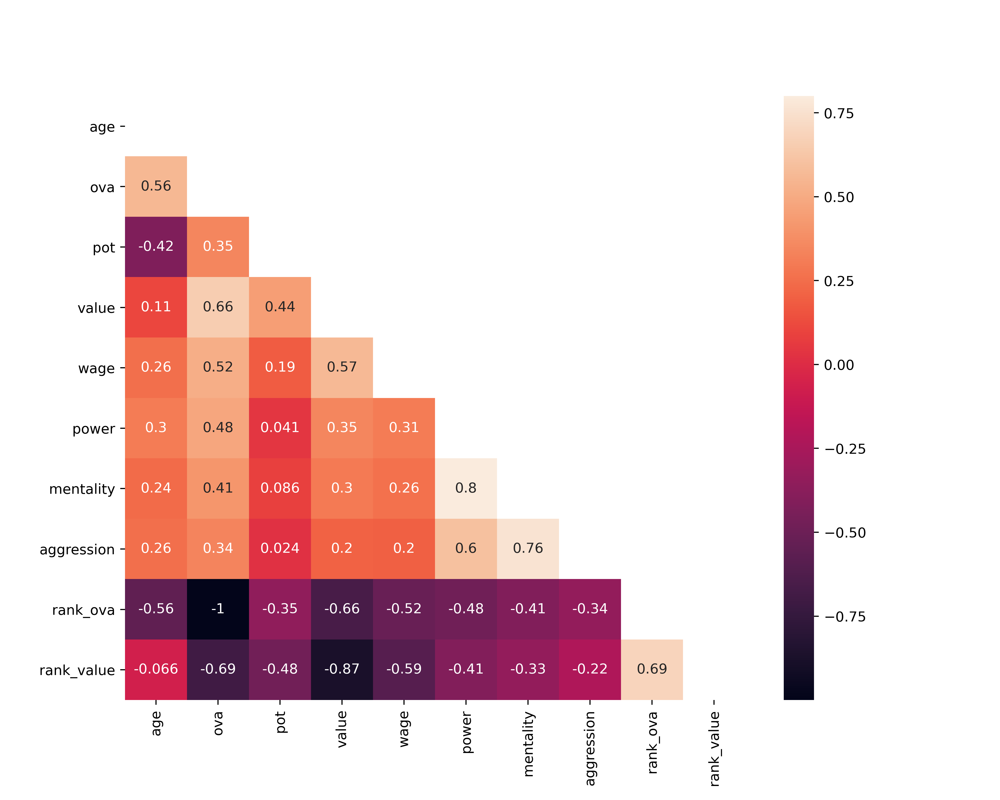
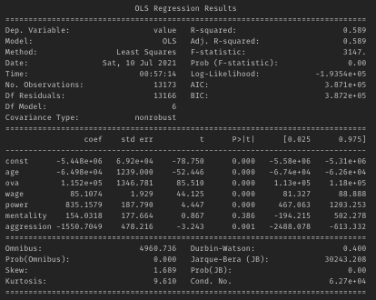

# P1_MoneyBall_Fifa

# 1 The objective of the project
The project is based on the Fifa 2021 dataset where we have columns with different type. 
Link to the source of the data https://www.kaggle.com/ekrembayar/fifa-21-complete-player-dataset
The main purpose of this project is to check if some variables are explained by the target column 'Value' which is the market value of the player. 
The second purpose is to see if the linear regression model fits to this data with the target. 

# 2 List of questions/hypothesis
Before the linear regression model, 3 questions will be answered to understand and analyse the dataset. 

    - Is the right or left player's foot who has the best perfromance ?
    - Top 3 players between 25 and 30 years old with the best performance.
    - Top 3 countries with the best market value of the player.

# 3 Explanation of how the data was processed (including the cleaning and selection of the variables to include in the model)
After importing libraries and the dataset, I explored all the columns and their data. 
From this overall view, I choosed 3 questions to answer for my analyse.
Before to answer to these questions, it's primordial to step by step clean the dataset. 

 1 --> Standrdizing the clomuns' name will make easier the manipulation of the dataset. 

 2 --> regarding to the huge amount of the columns (107 columns) in the dataset, I decided to create directly a new dataframe with the columns that I need for my 3 questions and for the linear regression model.
 I called the new dataframe : 'fifa'
 In this dataframe we can find the following columns : name, age, ova, nationality, pot, foot, value, wage, power, mentality and aggression.

 3 --> The next step is to check the columns' type. As we can see the columns 'value' and 'wage' are not numerical but we need them to be numerical for our analyse.
 For that I first drop and replace the symbols. 
 And then I converted these 2 columns from 'object' to 'int64'.

4 --> Checking null values is also important. As we can see there is not null values in our 'fifa' dataframe. 

5 --> We also check for duplicates. As we can see there is not duplicates in our 'fifa' dataframe. 
But to be more sure, I decided to count the unique values of the column 'name'. 
As we can see there are 10 rows with the name : 'J. Rodriguez'.
Instead of dropping it immediatly, I checked if for these 10 rows there are the same informations in the other columns.
And as we can see, there are 10 players with this name but with different infromations in the other columns.
So there is not meaning to drop them, that's why is important to check deaply the duplicates because this can be misleading. 

# 4 Data visualization
For the questions 1 and 3, I used python to answer to these questions but for the question 2, I used sql query.

- Question 1 : Is the right or left player's foot who has the best perfromance ?
I first rank the 'ova' column and then ordered by descending and filtered with the top 3 players. 
We can see that the top player is Messi and he is using his left foot.
In the world almost 85% of the people is using their right foot and the rest is using their left foot.
Messi is breaking the 'rules' and shows that a player using his left foot can have the best overall rating (93 points) in the football world.

- Question 2 : Top 3 players between 25 and 30 years old with the best performance.
The top 3 players are Neymar (28 years old), De Bruyne (20 years old) and Oblak (27 years old). All of them have 91 points for the overall rating. 

- Question 3 : Top 3 countries with the best market value of the player.
The top 3 countries are France with Mbappé (105.5M€), Netherlands with Van Dijk (75,5M€) and England with Sterling (72,5M€). 

# 5 Fitting the model
Before to do the linear regression, it is important to clean the outliers.
For this, I just cleaned the columns 'value' and 'wage' because it's only in these columns that we can have a lot of outliers. 

After that, it's time for the heatmap but for this we must first correlate the data. For this, I choosed the 'Pearson' method. 

We can see in the heatmap that there is any relation between the columns except between the mentality and power (80%) and between aggression and mentality (76%). 
During this project, i had the idea that the columns that I choose are impacting the market value of the player but as we can see, this hypothese is false. 

# 6 Linear Regression
To simply the generation of the OLS Regression Results for the linear model, I created a new dataframe which contains only the numerical columns.

When we run the model, R-squared is equal to 0.589
Contrary to what one might think, this score is not bad. 
When we are analysing people's behavior this R-quared is between 0 and 0.5. 
It is always hard to predict human behavior.
So this dataset fits goodly to the linear model. 
This shows again that the chosen columns are not impacting the market value of the player.   